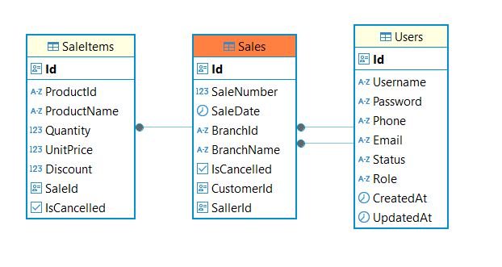
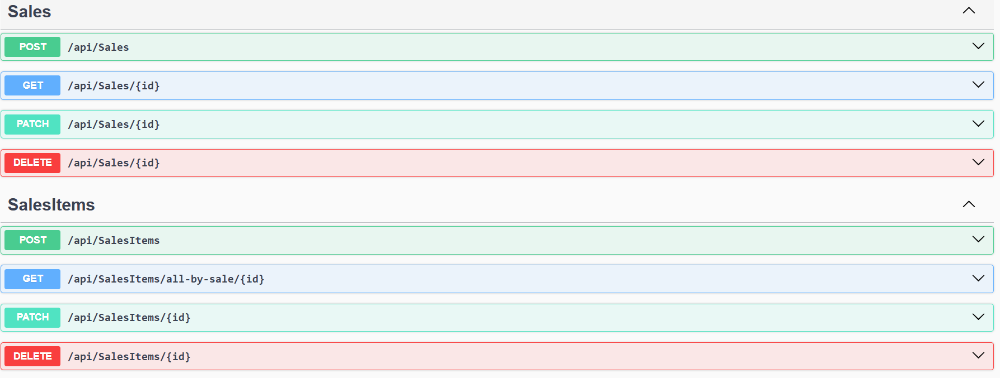

# Ambev [Projeto de Teste]

## Instruções

**Como executar o projeto**
`O projeto foi desenvolvido a tornar a tarefa de debugar muito simples`

- Clone o projeto para o ambiente de desenvolvimento.
- Na raiz do repositório abra o cmd e execute `docker-compose up -d`.
- Abra a documentação via:
  * Pelo [Swagger](https://localhost:8081/swagger/index.html)
  * Importe a [collection do postman](/Ambev.postman_collection.json) na raiz do repositório.

**Como debugar o projeto**
`Depois de clonar o projeto`
- Abra no Visual Studio a [solution](/src/Ambev.DeveloperEvaluation.sln) dentro do diretório /src na raiz do repositório.
- Caso tenha executado `docker-compose up -d` no passo anterior, execute o `docker-compose down`.
  * Isso é importante para que não haja choque de container e portas no docker com o container criado no momento do debug.
- Altere o startup da solution apontando para o projeto do `docker-compose`, para isso:
  * Clique com o botão direito do mouse no projeto `docker-compose`, no menu suspenso, clique em `Set as Startup Project`.

## Branchs
**O Desenvolvimento foi dividido em branchs**
 - **main** onde encontrasse todas os commits
 - **feature/code-refactoring** onde foram feitos o ajustes iniciais
 - **feature/sales-usercase** onde foram implementadas os casos de uso relativo a venda e item de venda.
   - Nesse houveram vários commits, cada qual representando um desenvolvimento `(melhor se fosse feito por branch)`.

## Desenvolvimento
**Foi criada funcionalidade de controle de vendas e items de venda.**
 - Abaixo podemos ver o relacionamento das entidades na base de dados o Postgres:

 - Abaixo podemos ver os endpoint para os casos de uso de vendas e item vendas:

## Orientações
**Melhorias previstas.**
`Esse projeto traz boas oportunidades de aplicar padrões no que diz respeito a microserviçoes, tais:`
- CQRS:
  `Como pattern para microserviço, visa separar operações de leitura e escrita, criando um micro serviço para operaçãos de escrita e outra para leitura.`
  - Usar o postgres nas command APIs
  Para cada command há um evento(snapshot da ultima atualização) mantido no - RabbitMQ, mas poderia ser qualquer outro sistema de mensageria.
  - Desenvolvimento de um deamon(worker) **indepotente** e **resiliente** como consumer desses eventos e atualizar num banco de dados não relacional, nesse caso sugiro o **MongoDB**.
  - As queries APIS deverão utilizar os dados mantinos no MongoDB.
- Aplicação de telemetria usando o padrão OpenTelemetry
- Aplicação de log estruturados
  `Oriento uso do ELK Stack com um sidecar no pod da aplicação para olhar os locas e mandar isso para o Elastic Search`
- Uso de cache distribuído com **Redis**
- Banco orientado a **Event-Sourcing**
